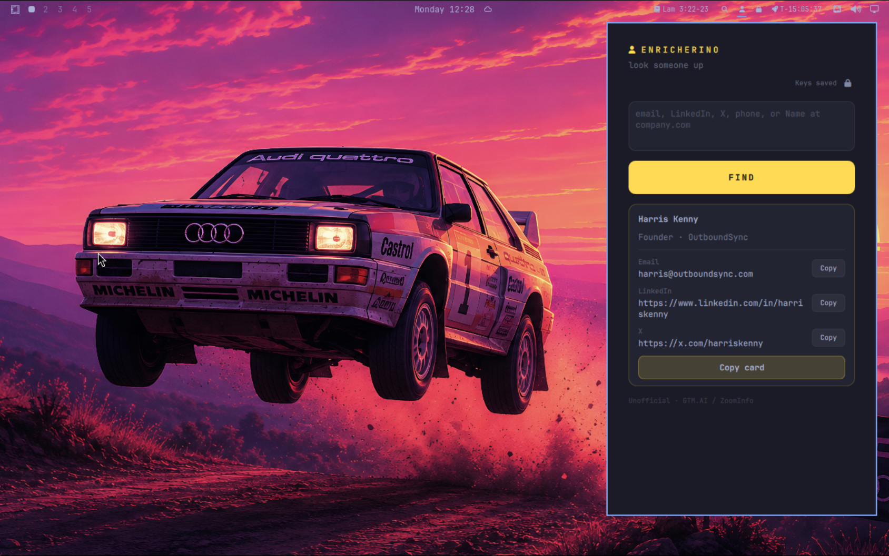

# Enricherino



Paste one thing. Hit FIND. Get a contact card.

Individual contact lookup for Omarchy — **yellow-pages / pixel desk joke, not a sequencer.**
Delight in ≤10 seconds. Waterfall under the hood. Unofficial.

**ID:** `kenhara.enricherino`  
**Author:** Harris Kenny  
**License:** MIT  
**Version:** 0.2.10

### 0.2.10
- Remove Panel `import "."` (was shadowing qs.Ui Panel under Loader → dead bar clicks); sibling types via qmldir/module context like Rocketlauncher.

### 0.2.9
- python3 -B + PYTHONDONTWRITEBYTECODE on lookup Process (stops __pycache__ reload storms); panel load error console.warn + truncated tooltip.

### 0.2.8
- Bar chip emoji 🔍 (glyph-only); Panel `import "."` so Loader resolves sibling types; best-effort panel load error in tooltip.

### 0.2.5
- Renamed plugin id `harris.enricherino` → `kenhara.enricherino` (install path `~/.config/omarchy/plugins/kenhara.enricherino`). Display name unchanged.

### 0.2.4
- Discoverability: expanded `keywords` + `barWidget.aliases` (LeadMagic/ZoomInfo/Apollo/etc.); honest search note.

### 0.2.2
- Pre-ship checklist: drop dead `handleSummonPayload`, LICENSE second `Software`
  unquoted, scrub `/workspace` from DESIGN, README hero `preview.png`, witty
  pitch ≤15 words, Controls L/R/M, monospace font fallback, hover on FIND/Copy,
  focus paste on open, honest “No clipboard tool” toast, UA from `manifest.json`.
  Kept phone honesty (no LeadMagic echo-ok) + waterfall `entered` labels.

### 0.2.1
- Audit fixes: named `Style.font.*` tokens (no fake `size(N)`), API keys via
  `Process.environment` (not argv), honest clipboard + toast, LeadMagic phone
  no longer echoes input as enrich, waterfall labels typed phone as `entered`,
  `ok` honors rejected guard, drop unused `dataChanged` / cache-dir Process /
  dead store flags, popout-switch close on Panel. Schema enum kept; keys live in
  shell settings plaintext — see AUDIT-NOTES.md.

### 0.2.0
- **Hard redesign — one paste, FIND, contact card.** Rip the SaaS form:
  provider chips and input-mode tabs leave the primary UI. Paste anything
  (email / LinkedIn / X / phone / `Name at company.com`); tiny detected-mode
  hint updates as you type; huge yellow **FIND**; contact card with name big,
  title · company, row Copy + **Copy card**. Keys hint is a one-liner. Quiet
  footer: unofficial · waterfall under the hood · not a sequencer. Schema still
  holds `leadmagicApiKey`, `zoominfoBearerToken`, `providerMode` (default
  waterfall).

### 0.1.2
- UI polish + richer HTML preview (interactive mock, sample result card).

### 0.1.1
- Playbook refresh: preview.png, middle-click clear, disk cache, honest
  capability copy, clearer Keys empty state.

### 0.1.0
- MVP — bar `● YP`, panel lookup, LeadMagic + ZoomInfo + waterfall, schema keys.

## Repository

**GitHub:** https://github.com/kenhara/omarchy-enricherino  
Local folder: **`omarchy-enricherino`**.

## Unofficial disclaimer

**Enricherino is unofficial.** It is **not** affiliated with, endorsed by, or
sponsored by LeadMagic, ZoomInfo, GTM.AI, or any related entity. It is a thin
personal client that calls public/documented HTTP APIs with **your** keys.
Use only for lawful individual follow-up. **Not a sequencer.**

## Discoverability

Marketplace filing: **Productivity** · tags `bar, quickshell` (suggest missing
tag: `crm` or `enrichment`).

Top-level `keywords` in `manifest.json` may help marketplace/search (LeadMagic,
ZoomInfo, GTM.AI, LinkedIn, Apollo, Clearbit, Hunter, etc.).
`barWidget.aliases` are for discovery docs and human search — the bar loader
may not index them. Display name stays **Enricherino** (brand-free).

## Install

### From GitHub

```sh
omarchy plugin add https://github.com/kenhara/omarchy-enricherino.git --enable
omarchy bar move kenhara.enricherino --section right
```

### Local copy (this tree)

The **git repo root is the plugin** (`manifest.json` at root). On an Omarchy
machine:

```sh
mkdir -p ~/.config/omarchy/plugins
cp -a . ~/.config/omarchy/plugins/kenhara.enricherino

omarchy plugin validate ~/.config/omarchy/plugins/kenhara.enricherino
omarchy-shell shell rescanPlugins

omarchy bar move kenhara.enricherino --section right
```

Hot reload applies on save under `~/.config/omarchy/plugins/`.

### Symlink (dev)

```sh
mkdir -p ~/.config/omarchy/plugins
ln -sfn /path/to/omarchy-enricherino ~/.config/omarchy/plugins/kenhara.enricherino
omarchy-shell shell rescanPlugins
```

## Configure keys

Open **widget settings** for Enricherino (Omarchy bar / plugin settings).
Advanced / schema only — not in the primary panel UI:

| Schema key | Label | Env passed to script |
|------------|-------|----------------------|
| `leadmagicApiKey` | LeadMagic API key | `LEADMAGIC_API_KEY` → header `X-API-Key` |
| `zoominfoBearerToken` | ZoomInfo / GTM.AI bearer token | `ZOOMINFO_BEARER_TOKEN` → `Authorization: Bearer …` |
| `providerMode` | Provider mode: `leadmagic` \| `zoominfo` \| `waterfall` (default) | CLI `--provider` |

**Do not commit real keys.** Defaults are empty strings. Schema keys live in
shell settings **plaintext**. At lookup time they are passed via
`Process.environment` (not argv) for that one call only — **never** written to
`~/.cache/enricherino/`.

Without keys, the panel shows a compact one-liner: **add keys in widget settings**.

CLI smoke (optional):

```sh
export LEADMAGIC_API_KEY='…'
export ZOOMINFO_BEARER_TOKEN='…'
python3 scripts/lookup.py --provider waterfall --mode email --json '{"email":"a@b.com"}'
```

## Usage

1. **Left-click** bar `● YP` → panel.
2. Paste into the one field: email, LinkedIn, X, phone, or `Name at company.com`.
3. Tiny hint under the field (“looks like an email”) updates as you type.
4. Hit **FIND** (or Enter in the paste field). Mode is auto-detected; existing
   lookup modes still run under the hood via `scripts/lookup.py`.
5. **Contact card:** name big, title · company, then email / phone / LinkedIn / X
   with per-row **Copy**, plus one **Copy card**.
6. **Middle-click** bar clears the last result (and cache) — does **not** auto-fire paid APIs.

### Controls

| Input | Action |
|-------|--------|
| Left-click bar | Toggle panel |
| Middle-click bar | Clear last result (+ cache); toast "Cleared" |
| Right-click bar | (none) |
| Paste field | One multiline/paste; Enter triggers FIND |
| FIND | Detect mode → fill inputs → `lookup()` |
| Copy / Copy card | Clipboard field or full card (toast only on success) |
| Keys one-liner | Shown when required key(s) missing |

### Detect modes

| Hint | Trigger |
|------|---------|
| looks like an email | has `@`, no http (and not `Name @ Company` / `at` patterns) |
| looks like a profile URL | linkedin.com / x.com / twitter.com / http(s) |
| looks like a phone | mostly digits / `+` `()` `-` |
| looks like name + company | `Name at domain`, `Name @ Company`, `Name, domain.com` |

Provider waterfall stays the default in schema — no chips in the primary UI.
`providerMode` remains a schema **enum** (`leadmagic` | `zoominfo` | `waterfall`);
change it in widget settings (chip-style picker if the shell renders enum options).

### Honest capability notes

- **Phone → contact** is **ZoomInfo-only** in MVP (LeadMagic skips; waterfall
  still works when a ZoomInfo token is present).
- **X/Twitter profile URL** is **best-effort**; LinkedIn profile URLs hit more
  reliably on both providers.
- Individual follow-up only — **not a sequencer**.

## Controls / flows that work

| Mode | LeadMagic | ZoomInfo | Waterfall |
|------|-----------|----------|-----------|
| Email | `POST /v1/people/b2b-profile` (+ mobile-finder) | Contact enrich `email` / `emailAddress` | LM then ZI for gaps |
| Profile URL (LinkedIn **or** X/Twitter) | profile-search + b2b-profile-email (+ personal-email + mobile) | enrich `externalURL` | LM then ZI |
| Name + company | email-finder (`first_name`/`last_name`/`domain`) then profile | enrich `fullName`+`companyName` | LM then ZI |
| Phone | honest skip (no clear LM phone→profile in MVP) | enrich `phone` | ZI fills when LM cannot |

Waterfall = LeadMagic first, then ZoomInfo only for still-missing fields.

## Remove

```sh
omarchy plugin remove kenhara.enricherino
```

Optional cache cleanup:

```sh
rm -rf ~/.cache/enricherino
```

## Network

- LeadMagic: `https://api.leadmagic.io`
- ZoomInfo GTM: `POST https://api.zoominfo.com/gtm/data/v1/contacts/enrich`

Outbound HTTPS only when you click FIND. Keys stay in widget settings /
process env for that one call — never written into the repo or the result cache.
User-Agent: `Enricherino/<manifest version> (Omarchy unofficial; kenhara.enricherino)`.

Cache (last **successful** lookup only): `~/.cache/enricherino/last.json`.

## Scripts

`scripts/lookup.py` — urllib only, no extra deps. Modes unchanged.

```sh
python3 scripts/lookup.py --help
python3 scripts/lookup.py --provider leadmagic|zoominfo|waterfall \
  --mode email|profile|name_company|phone --json '{…}'
```

## Layout

```
manifest.json          # kenhara.enricherino @ 0.2.2
BarWidget.qml          # bar entry + Loader → Panel; middle-click clear
Panel.qml              # paste + FIND + contact card
YellowStore.qml        # pasteInput, detectMode, findFromPaste, cache, lookup
qmldir
scripts/lookup.py
docs/preview/index.html
preview.svg
preview.png
DESIGN.md
PRE-SHIP.md
REPO.md
LICENSE                # MIT
README.md
```

## Security baseline

- Keys live in **Omarchy shell / widget settings as plaintext** (schema strings).
  Injected via `Process.environment` for a single `lookup.py` run — **not** in
  argv. **Never** persisted to `~/.cache/enricherino/` or the repo.
- Cache stores the last successful result card — no API keys / bearer tokens.
- Outbound HTTPS only on explicit FIND. No auto-fire on panel open or middle-click.
- MIT at repo root. Unofficial — not affiliated with LeadMagic, ZoomInfo, or GTM.AI.

## Preview

Open `docs/preview/index.html` in a browser for an **interactive** HTML mock
(v0.2.4): paste field + FIND toggles to the Alex-style contact card. No provider
chips. Banner **v0.2.4 HTML mock**. Marketplace card: `preview.png` (from
`preview.svg`).

## License

MIT — see [LICENSE](LICENSE).
